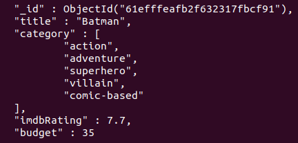
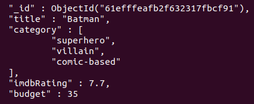
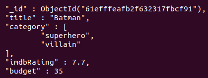
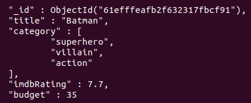
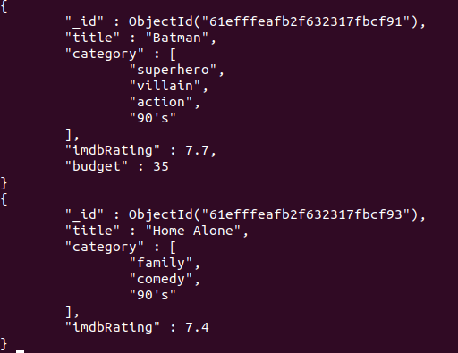
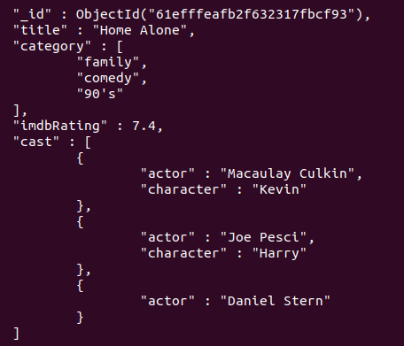
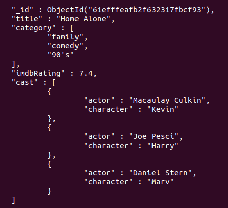
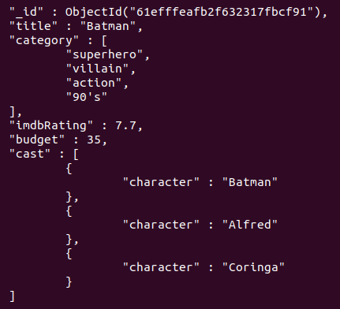
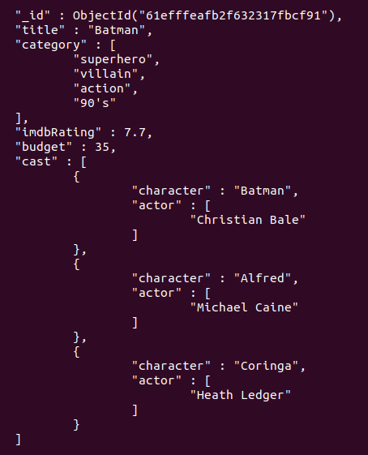
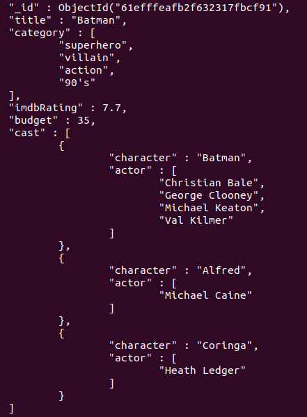

# Agora a prática

Para praticar, você utilizará um dataset de filmes. Para isso, conecte-se à sua instância e utilize o trecho de código abaixo para criar o banco de dados e inserir os documentos:

```javascript
db.movies.drop();
db.movies.insertMany([
  {
    title: "Batman",
    category: [
      "action",
      "adventure",
    ],
    imdbRating: 7.7,
    budget: 35,
  },
  {
    title: "Godzilla",
    category: [
      "action",
      "adventure",
      "sci-fi",
    ],
    imdbRating: 6.6,
    budget: 1,
  },
  {
    title: "Home Alone",
    category: [
      "family",
      "comedy",
    ],
    imdbRating: 7.4,
  },
]);
```

Para cada execução, utilize o método find() para conferir as alterações nos documentos.

O MongoDb possui diversas ferramentas, como, por exemplo, **mongo**, **mongosh**, **Compass** e outras ferramentas de terceiros. Você pode utilizar o que achar melhor para executar as queries, o importante é realizá-las.

**Exercício 1:** Adicione a categoria **"superhero"** ao filme **Batman**.

Após a execução do método **.find().pretty()**, o resultado do filme Batman será parecido com o dessa imagem:


```javascript
db.movies.updateOne(
  { title: 'Batman' },
  { $push: { category: 'superhero' } }
);
```

**Exercício 2:** Utilizando o modificador $each, adicione as categorias **"villain"** e **"comic-based"** ao filme **Batman**.
Após a execução do método **.find().pretty()**, o resultado do filme **Batman** será parecido com o dessa imagem:



```javascript
db.movies.updateOne(
  { title: 'Batman' },
  { 
    $push: {
      category: { $each: ['villain', 'comic-based'] }
    }
  }
);
```

**Exercício 3:** Remova a categoria **"action"** do filme **Batman**.
Após a execução do método **.find().pretty()**, o resultado do filme **Batman** será parecido com o dessa imagem:


```javascript
db.movies.updateOne(
  { title: 'Batman' },
  { 
    $pull: {
      category: 'action'
    }
  }
);
```

**Exercício 4:** Remova o primeiro elemento do array **category** do filme **Batman**.
Após a execução do método **.find().pretty()**, o resultado do filme **Batman** será parecido com o dessa imagem:



```javascript
db.movies.updateOne(
  { title: 'Batman' },
  { $pop: { category: -1 } }
);
```

**Exercício 5:** Remova o último elemento do array **category** do filme **Batman**.

Após a execução do método **.find().pretty()**, o resultado do filme **Batman** será parecido com o dessa imagem:



```javascript
db.movies.updateOne(
  { title: 'Batman' },
  { $pop: { category: 1 } }
);
```

**Exercício 6:** Adicione o elemento **"action"** ao array **category** do filme **Batman**, garantindo que esse valor não se duplique.

Após a execução do método **.find().pretty()** o resultado do filme **Batman** será parecido com o dessa imagem:



```javascript
db.movies.updateOne(
  { title: 'Batman' },
  { $addToSet: { category: 'action' } }
);
```

**Exercício 7:** Adicione a categoria **"90's"** aos filmes **Batman** e **Home Alone**.

Após a execução do método **.find().pretty()**, o resultado do filme **Batman** e do filme **Home Alone** será parecido com o dessa imagem:



```javascript
db.movies.updateMany(
  { title: { $in: ['Batman', 'Home Alone'] } },
  { $addToSet: { category: '90\'s' } }
);
```

**Exercício 8:** Crie um array de documentos chamado **cast** para o filme **Home Alone** com os seguintes dados:

```javascript
{
  "actor": "Macaulay Culkin",
  "character": "Kevin"
},
{
  "actor": "Joe Pesci",
  "character": "Harry"
},
{
  "actor": "Daniel Stern"
}
```

Após a execução do método **.find().pretty()**, o resultado do filme **Home Alone** será parecido com o dessa imagem:



```javascript
db.movies.updateOne(
  { title: 'Home Alone' },
  {
    $push: {
      cast: {
        $each: [
          {
            "actor": "Macaulay Culkin",
            "character": "Kevin"
          },
          {
            "actor": "Joe Pesci",
            "character": "Harry"
          },
          {
            "actor": "Daniel Stern"
          }
        ]
      }
    }
  }
);
```

**Exercício 9:** Adicione o campo **character** com o valor **Marv** ao array de **cast** em que o campo **actor** seja igual a **Daniel Stern** no filme **Home Alone**.

**Dica:** Para isso, [leia aqui](https://docs.mongodb.com/manual/reference/operator/update/positional/) sobre o operador **$**.

Após a execução do método **.find().pretty()**, o resultado do filme **Home Alone** será parecido com o dessa imagem:



```javascript
db.movies.updateOne(
  { title: 'Home Alone', 'cast.actor': 'Daniel Stern' },
  { $push: { 'cast.$.character': 'Marv' } }
);
```

**Exercício 10:** Crie um array de documentos chamado **cast** para o filme **Batman** com os seguintes dados:

```javascript
{
  "character": "Batman"
},
{
  "character": "Alfred"
},
{
  "character": "Coringa"
}
```

Após a execução do método **.find().pretty()**, o resultado do filme **Batman** será parecido com o dessa imagem:



```javascript
db.movies.updateOne(
  { title: 'Batman' },
  {
    $push: {
      cast: { 
        $each: [
          { "character": "Batman" },
          { "character": "Alfred" },
          { "character": "Coringa" }
        ]
      }
    }
  }
);
```

**Exercício 11:** Produza três querys para o filme **Batman**:

* Adicione o campo **actor**, que deve ser um array com o valor **Christian Bale**, ao array de **cast** em que o campo **character** seja igual a **Batman**;

* Adicione o campo **actor**, que deve ser um array com o valor **Michael Caine**, ao array de **cast** em que o campo **character** seja igual a **Alfred**;

* Adicione o campo **actor**, que deve ser um array com o valor **Heath Ledger**, ao array de **cast** em que o campo **character** seja igual a **Coringa**.

**Dica:** Para isso, [leia aqui](https://docs.mongodb.com/manual/reference/operator/update/positional/) sobre o operador **$**.

Após a execução do método **.find().pretty()** o resultado do filme **Batman** será parecido com o dessa imagem:



```javascript
db.movies.updateOne(
  { title: 'Batman', 'cast.character': 'Batman' },
  { $push: { 'cast.$.actor': 'Christian Bale' } }
);

db.movies.updateOne(
  { title: 'Batman', 'cast.character': 'Alfred' },
  { $push: { 'cast.$.actor': 'Michael Caine' } }
);

db.movies.updateOne(
  { title: 'Batman', 'cast.character': 'Coringa' },
  { $push: { 'cast.$.actor': 'Heath Ledger' } }
);
```

**Exercício 12:** Adicione aos atores de **cast** do **character Batman** do filme **Batman** os valores **"Michael Keaton"**, **"Val Kilmer"** e **"George Clooney"**, e deixe o array em ordem alfabética.

**Dica:** Para isso, [leia aqui](https://docs.mongodb.com/manual/reference/operator/update/positional/) sobre o operador **$**.

Após a execução do método **.find().pretty()**, o resultado do filme **Batman** será parecido com o dessa imagem:



```javascript
db.movies.updateOne(
  { title: 'Batman', 'cast.character': 'Batman' },
  {
    $push: {
      'cast.$.actor': {
        $each: [
          'Michael Keaton',
          'Val Kilmer',
          'George Clooney'
        ],
        $sort: 1
      }
    },
  }
);
```
